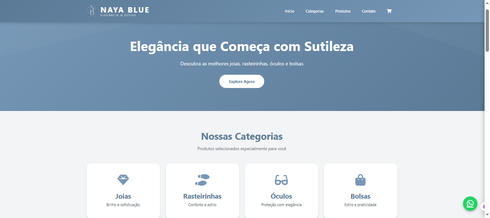
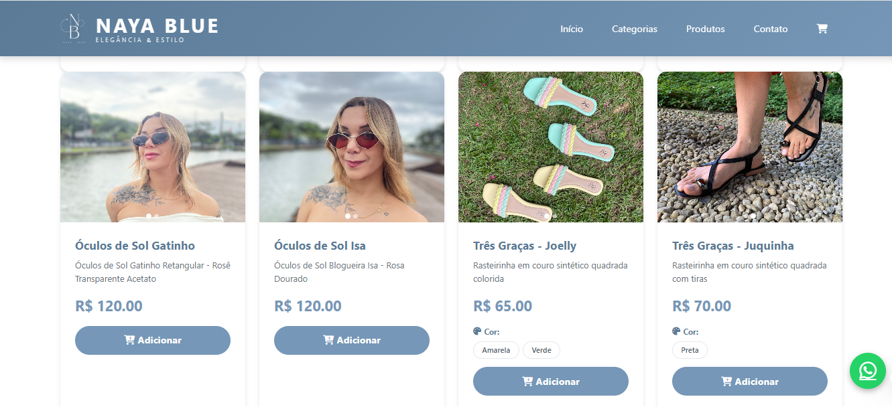
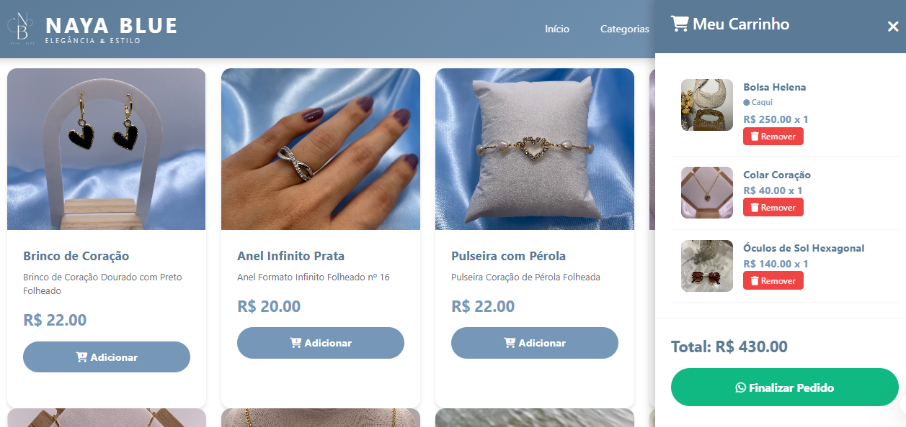

# Naya Blue — E-commerce

E-commerce desenvolvido para a Naya Blue com foco em experiência do usuário, conversão de vendas e integração entre catálogo, carrinho, checkout, WhatsApp e ferramentas Google.

## 🚀 Demonstração

**Site:** https://nayablue.netlify.app/

## 🖥️ Interface do projeto

### Página inicial

### Catálogo de produtos

### Carrinho de compras

## 📋 Sobre o projeto

O Naya Blue foi desenvolvido como uma solução de e-commerce para apresentação dos produtos e recebimento de pedidos.

Durante o desenvolvimento, a aplicação evoluiu de uma estrutura inicial de catálogo para uma solução com:

* catálogo de produtos;
* categorias e filtros;
* carrinho de compras;
* checkout;
* cálculo de frete;
* opção de retirada;
* envio dos dados do pedido pelo WhatsApp;
* integração com Google Sheets;
* gerenciamento de produtos através de planilha;
* acompanhamento dos pedidos;
* suporte a múltiplas imagens por produto;
* carrossel de imagens;
* visualização ampliada em Lightbox;
* interface responsiva.

## 🛠️ Tecnologias

* HTML5
* CSS3
* JavaScript
* Bootstrap
* Google Sheets
* Google Apps Script
* Netlify
* WhatsApp
* Mercado Pago

## 🛒 Principais funcionalidades

### Catálogo

Organização dos produtos por categorias, com informações de preço, imagens e identificação dos produtos.

### Carrinho de compras

O usuário pode adicionar produtos ao carrinho, visualizar os itens selecionados e acompanhar o valor da compra.

### Checkout

O fluxo de compra coleta as informações necessárias do cliente e permite selecionar a forma de recebimento:

* Retirada;
* Frete.

Quando o frete é selecionado, o valor correspondente é acrescentado ao pedido.

### WhatsApp

Após a confirmação do pedido, as informações da compra são estruturadas e encaminhadas para o WhatsApp da Naya Blue.

O fluxo foi desenvolvido para facilitar o atendimento e reduzir o trabalho manual de conferência das informações do pedido.

### Google Sheets

Foi criada uma estrutura utilizando Google Sheets e Google Apps Script para armazenar e organizar os pedidos.

Também foi desenvolvida uma planilha para cadastro e gerenciamento dos produtos.

### Gestão de produtos

A planilha de produtos possui recursos como:

* validação de dados;
* formatação de moeda;
* indicadores de preenchimento;
* formatação condicional;
* instruções de utilização;
* cabeçalho protegido;
* notas explicativas;
* congelamento do cabeçalho.

### Imagens dos produtos

Produtos com múltiplas imagens possuem:

* carrossel automático;
* transição de imagens;
* setas de navegação;
* indicadores de posição;
* Lightbox;
* navegação por teclado;
* fechamento com `Esc`.

## 🔄 Evolução do projeto

O projeto passou por várias etapas de desenvolvimento, desde a criação inicial do catálogo até a implementação do fluxo completo de pedidos.

### Versão inicial

* criação das seções de produtos;
* estrutura inicial do catálogo;
* implementação do carrinho.

### Evolução visual

* refinamento da identidade visual;
* destaque da logo;
* criação do favicon;
* definição da cor principal;
* ajustes de categorias;
* atualização das informações da marca.

### Experiência do carrinho

* badge de quantidade de produtos;
* animação de destaque;
* melhoria da navegação;
* chamada para visualização do carrinho.

### Checkout

* formulário de dados do cliente;
* forma de recebimento;
* retirada;
* cálculo de frete;
* envio das informações pelo WhatsApp.

### Integração com Google

Para solucionar a necessidade de armazenar os pedidos de forma organizada, foi desenvolvida uma integração utilizando:

**Google Sheets + Google Apps Script**

A solução permitiu centralizar os pedidos e manter um histórico organizado.

### Gestão do catálogo

Foi criada uma planilha específica para facilitar o cadastro dos produtos pela cliente.

### Catálogo final

* inclusão da categoria Bolsas;
* cadastro dos produtos;
* inclusão das fotografias;
* suporte a múltiplas imagens;
* carrossel;
* Lightbox;
* ajustes finais de produtos, cores e numeração.

## 🎯 Objetivos técnicos

O projeto buscou aplicar conceitos de:

* desenvolvimento web;
* manipulação do DOM;
* JavaScript;
* responsividade;
* experiência do usuário;
* fluxo de conversão;
* integração com APIs;
* automação;
* armazenamento de dados;
* organização de catálogo;
* resolução de problemas reais de negócio.

## 📌 Projeto real

Este projeto foi desenvolvido para uma cliente real e evoluiu de acordo com necessidades apresentadas durante o desenvolvimento.

As decisões técnicas foram tomadas considerando fatores como prazo de lançamento, facilidade de utilização, manutenção e custo operacional.

## 👨‍💻 Desenvolvedor

**Alan Souza Gomes**

Engenheiro de Software | Desenvolvimento Web | JavaScript | Cloud

[LinkedIn](https://www.linkedin.com/in/alan-gom/)
